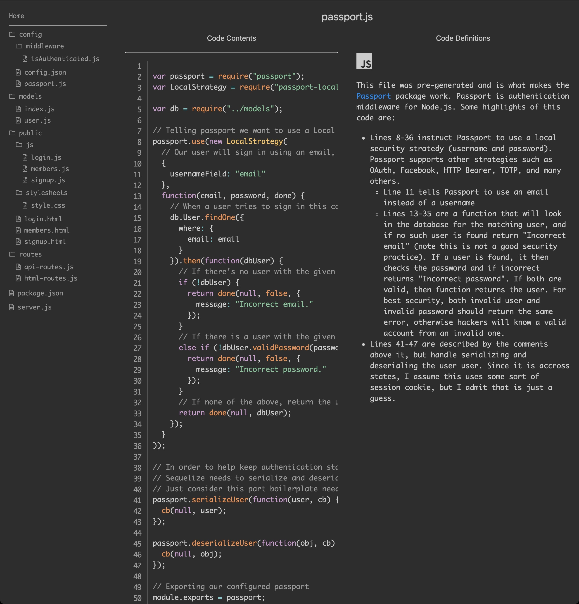

# SMU-Homework-14-Reverse-Engineering-Code

Homework 14 was to review a provided website skeleton and explain what the code was doing.

## Site Explanation

This was originally an assignment that required us to submit a Google Docs response. However, I hate Google Docs so I figured I'd make a website instead that explained the code. This is the result.

## Usage

To view the site I built for this, click [here](https://emu-homework-14.herokuapp.com).

## Screenshot

